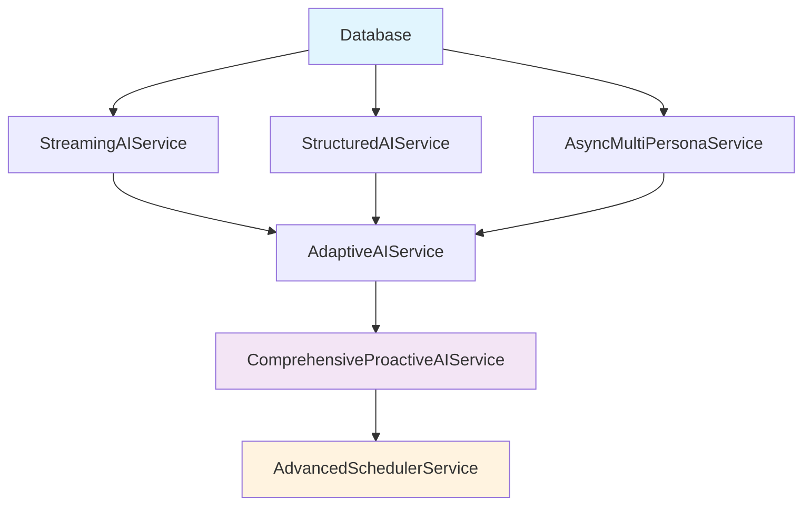

# AI Service Initialization Guide
## Prevention & Debugging Framework

*Enhanced AI debugging system to prevent constructor issues and ensure proper service initialization*

---

## 🚨 Critical Issue Prevention

### **Recent Issue: Constructor Parameter Mismatch**
- **Problem**: Services initialized with wrong number of parameters  
- **Impact**: Complete AI system failure ("0 opportunities found")
- **Solution**: Enhanced validation system with real-time checks

### **Enhanced Debugging Endpoints**
```bash
# 🔍 NEW: Service Initialization Validation
GET /ai-debug/service-initialization/validate-all
GET /ai-debug/service-initialization/guide/{service_name}
POST /ai-debug/service-initialization/validate
GET /ai-debug/service-initialization/recent-failures

# 🔍 NEW: AI Response Quality Validation
GET /ai-debug/ai-responses/validate-structure
```

---

## 🏗️ AI Service Architecture

### **Service Dependencies & Initialization Order**



### **Critical Service Initialization Map**

| Service | Required Dependencies | Constructor | Initialization Order |
|---------|----------------------|-------------|-------------------|
| `StreamingAIService` | `db` | `StreamingAIService(db)` | 1 |
| `StructuredAIService` | `db` | `StructuredAIService(db)` | 2 |
| `AsyncMultiPersonaService` | `db` | `AsyncMultiPersonaService(db)` | 3 |
| `AdaptiveAIService` | `pulse_ai`, `pattern_analyzer` | `AdaptiveAIService(pulse_ai, pattern_analyzer)` | 4 |
| `ComprehensiveProactiveAIService` | `db` | `ComprehensiveProactiveAIService(db)` | 5 |
| `AdvancedSchedulerService` | `db` | `AdvancedSchedulerService(db)` | 6 |

---

## 🔧 Proper Initialization Examples

### **✅ CORRECT: ComprehensiveProactiveAIService**
```python
from app.services.comprehensive_proactive_ai_service import ComprehensiveProactiveAIService
from app.core.database import get_database

# Initialize database dependency first
db = get_database()

# Then initialize the service with correct parameters
comprehensive_ai = ComprehensiveProactiveAIService(db)  # ✅ Correct: 1 parameter
```

### **❌ INCORRECT: What Was Causing the Bug**
```python
# This was causing the initialization failure:
adaptive_ai = AdaptiveAIService(None, None)  # ❌ Wrong: None values
comprehensive_ai = ComprehensiveProactiveAIService(db, adaptive_ai)  # ❌ Wrong: 2 parameters
```

### **✅ CORRECT: AsyncMultiPersonaService**
```python
from app.services.async_multi_persona_service import AsyncMultiPersonaService
from app.core.database import get_database

# Initialize database dependency first
db = get_database()

# Then initialize the service
async_multi_persona = AsyncMultiPersonaService(db)  # ✅ Correct: 1 parameter
```

### **❌ INCORRECT: Previous Bug**
```python
# This was causing the second initialization failure:
async_multi_persona = AsyncMultiPersonaService()  # ❌ Wrong: Missing db parameter
```

---

## 🛡️ Prevention Framework

### **1. Service Initialization Validator**

Use the built-in validator before any service initialization:

```python
from app.services.service_initialization_validator import service_validator

# Validate before initialization
validation_result = await service_validator.validate_service_initialization(
    service_name="ComprehensiveProactiveAIService",
    constructor_kwargs={"db": db}
)

if validation_result.validation_passed:
    # Safe to initialize
    service = ComprehensiveProactiveAIService(db)
else:
    # Fix issues first
    logger.error(f"Validation failed: {validation_result.errors}")
```

### **2. Development Guidelines**

#### **Before Adding New Services:**
1. **Register in validator**: Add to `ServiceInitializationValidator._register_ai_services()`
2. **Document dependencies**: Update this guide with constructor requirements
3. **Test initialization**: Use `/ai-debug/service-initialization/validate-all`
4. **Update health checks**: Add to monitoring endpoints

#### **Before Changing Constructors:**
1. **Validate impact**: Check all places where service is initialized
2. **Update validator**: Modify required dependencies in registry
3. **Test thoroughly**: Run validation endpoints
4. **Update documentation**: Keep this guide current

### **3. CI/CD Integration**

Add to your deployment pipeline:

```yaml
# .github/workflows/ai-validation.yml
- name: Validate AI Service Initialization
  run: |
    curl -f "https://your-api/ai-debug/service-initialization/validate-all" || exit 1
```

---

## 🔍 Enhanced Debugging Workflow

### **Step 1: Real-time Health Monitoring**
```bash
# Check overall AI system health
curl "https://pulsecheck-mobile-app-production.up.railway.app/api/v1/ai-debug/service-initialization/validate-all"
```

### **Step 2: Service-Specific Debugging**
```bash
# Get initialization guide for specific service
curl "https://pulsecheck-mobile-app-production.up.railway.app/ai-debug/service-initialization/guide/ComprehensiveProactiveAIService"
```

### **Step 3: Validate Before Deployment**
```bash
# Check for recent initialization failures
curl "https://pulsecheck-mobile-app-production.up.railway.app/ai-debug/service-initialization/recent-failures"
```

### **Step 4: AI Response Quality Check**
```bash
# Validate AI response structure and quality
curl "https://pulsecheck-mobile-app-production.up.railway.app/ai-debug/ai-responses/validate-structure"
```

---

## 📋 Common Issues & Solutions

### **Issue 1: Constructor Parameter Mismatch**
**Symptoms**: `__init__() takes 2 positional arguments but 3 were given`
**Solution**: 
```python
# Check constructor signature
GET /ai-debug/service-initialization/guide/{service_name}

# Fix parameter count
service = ServiceName(correct_params)  # Use proper parameters
```

### **Issue 2: Missing Required Dependencies**
**Symptoms**: `missing 1 required positional argument`
**Solution**:
```python
# Ensure all dependencies are initialized first
db = get_database()
pulse_ai = PulseAI(db=db)
pattern_analyzer = UserPatternAnalyzer(db=db)

# Then initialize dependent service
adaptive_ai = AdaptiveAIService(pulse_ai, pattern_analyzer)
```

### **Issue 3: Generic AI Responses**
**Symptoms**: AI returning "I understand" instead of persona-specific content
**Solution**:
```python
# Check response quality
GET /ai-debug/ai-responses/validate-structure

# Improve prompt engineering based on validation results
```

### **Issue 4: Circular Dependencies**
**Symptoms**: Services failing to initialize due to dependency loops
**Solution**:
```python
# Follow initialization order from the dependency map
# Initialize in correct sequence: 1 → 2 → 3 → 4 → 5 → 6
```

---

## 🧪 Testing & Validation

### **Pre-deployment Checklist**
- [ ] Run `/ai-debug/service-initialization/validate-all`
- [ ] Check constructor signatures match usage
- [ ] Verify all dependencies are properly initialized
- [ ] Test AI response quality with `/ai-debug/ai-responses/validate-structure`
- [ ] Monitor for generic responses or fallback patterns

### **Production Monitoring**
```bash
# Set up monitoring alerts for:
# 1. Service initialization failures
# 2. Generic AI responses
# 3. Constructor parameter mismatches
# 4. Missing dependencies

# Example monitoring check
curl -f "https://your-api/ai-debug/service-initialization/validate-all" || alert_team
```

---

## 🔗 Integration with Existing Systems

### **Existing Debugging Endpoints**
This guide enhances the existing debugging system:
- `AI-DEBUGGING-SYSTEM.md` - Base debugging framework
- `/debug/*` - System health monitoring
- `/ai-debug/*` - AI-specific debugging
- `/monitoring/*` - Error logging and tracking

### **Enhanced Monitoring Stack**
```
┌─────────────────────────────────────────────────────┐
│ AI Service Initialization Validator (NEW)          │
├─────────────────────────────────────────────────────┤
│ AI Response Structure Validator (NEW)              │
├─────────────────────────────────────────────────────┤
│ Existing AI Debugging System                       │
├─────────────────────────────────────────────────────┤
│ System Health Monitoring                           │
├─────────────────────────────────────────────────────┤
│ Error Logging & Recovery                           │
└─────────────────────────────────────────────────────┘
```

---

## 📚 Quick Reference

### **Emergency Debugging Commands**
```bash
# 🚨 AI system not working?
curl "https://your-api/ai-debug/service-initialization/validate-all"

# 🔍 Check specific service
curl "https://your-api/ai-debug/service-initialization/guide/ComprehensiveProactiveAIService"

# 📊 View recent failures
curl "https://your-api/ai-debug/service-initialization/recent-failures"

# 🎯 Validate AI response quality
curl "https://your-api/ai-debug/ai-responses/validate-structure"
```

### **Constructor Quick Reference**
```python
# All AI services use consistent patterns:
service = ServiceName(db)                    # Most services
service = AdaptiveAIService(pulse_ai, analyzer)  # Exception: needs 2 params
```

---

## 📝 Next Steps

1. **Deploy the enhanced validation system** to production
2. **Add validation to CI/CD pipeline** for automatic checks
3. **Train team** on proper initialization patterns
4. **Monitor production** for initialization issues
5. **Update documentation** when adding new services

This enhanced debugging framework prevents the constructor issues that caused the recent AI system failures and provides comprehensive monitoring for future issues. 